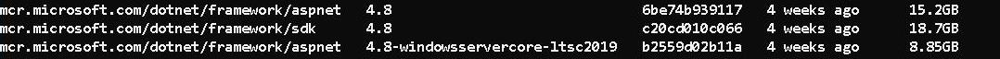
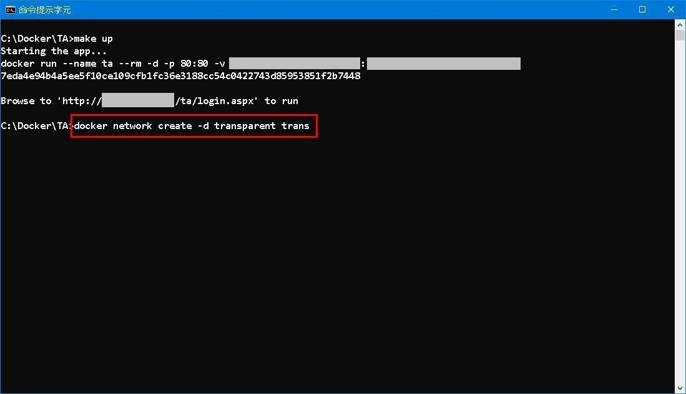

# Dockerize WebForm Application<br /> ─ 「[最後一公里](https://zh.wikipedia.org/zh-tw/%E6%9C%80%E5%90%8E%E4%B8%80%E5%85%AC%E9%87%8C)」之「[行百里者半於九十](https://ctext.org/zhan-guo-ce/qin-wu/zh)」


(*Photo from movie [Mile 22](https://www.imdb.com/title/tt4560436/)*)

## 0. Prologue
It was a windy Friday night, I laid as if i had been stabbed on my back. My brain awake 
but i was unable to move. Numb as i was and spirits floating around. Suddenly, a 
strange idea dawned upon me to *dockerize* ta so as to improve my IT skills. 

I thought again and again what I was doing and what was still missing. Procedures and 
steps to fulfill my plan was vaguely formed. It was an experiment to run real world 
**WebForm** Application on Docker containers, on Windows platform of course. 

The only software I need was [Docker Desktop for Windows](https://docs.docker.com/desktop/windows/install/). The price is free, the value is priceless -- in order to run Windows containers, [Hyper-V](https://docs.microsoft.com/en-us/virtualization/hyper-v-on-windows/about/) is a must! That means after installation, virtualization software such as [VMWare](https://en.wikipedia.org/wiki/VMware_Workstation) and [VirtualBox](https://en.wikipedia.org/wiki/VirtualBox) will cease to function. 

To be honest, Windows container is a barren field (*virgin* was used in draft) that few people dare to challenge with... 

---
### `corrigendum`
According to [Oracle&copy; VM VirtualBoxAdministrator's Guide for Release 6.0](https://docs.oracle.com/en/virtualization/virtualbox/6.0/admin/hyperv-support.html): 

> 2.33. Using Hyper-V with Oracle VM VirtualBox<br />
Oracle VM VirtualBox can be used on a Windows host where Hyper-V is running. This is an experimental feature. <br /><br />
No configuration is required. Oracle VM VirtualBox detects Hyper-V automatically and uses Hyper-V as the virtualization engine for the host system. The CPU icon in the VM window status bar indicates that Hyper-V is being used.<br /><br />
**Note**<br />
When using this feature, some host systems might experience significant Oracle VM VirtualBox performance degradation.<br />
---


## 1. The App
This is the easy part. Since TA is written in such a way that no external dependency exists. 
All packages are installed via NuGet package manager at application level. It connects to an 
oracle database as defined in web.config: 

```xml
<add name="conn" connectionString="DATA SOURCE=my-oracle/mypdb;USER ID=myuserid;PASSWORD=mypwd;PERSIST SECURITY INFO=True;Connection Timeout=120;Max Pool Size=500;" providerName="Oracle.ManagedDataAccess.Client" />
```

TA uses **.NET v4.5 Classic** application pool runs under **Default Web Site**. 


## 2. The Image 
Officially, there are two images capable of running WebForm programs: 
```console
   mcr.microsoft.com/dotnet/framework/aspnet:4.8
```
   
for .NET framework version 4.8, which is the latest.  
```console
   mcr.microsoft.com/dotnet/framework/aspnet:3.5
```
for .NET framework version 3.5, which is for older programs. 

Around **`15G`** each! Just spend some time to pull your image in lunch time... 

---
### `corrigendum`

Using image **mcr.microsoft.com/dotnet/framework/aspnet:4.8-windowsservercore-ltsc2019** significantly reduces image size.


---


## 3. The Scripts 
The hardcore part of dockerizing is to create a Dockerfile. 

   ```yml
   FROM mcr.microsoft.com/dotnet/framework/aspnet:4.8

   SHELL ["powershell"]

   RUN New-Item -Path 'C:\inetpub\wwwroot\TA' -Type Directory; \
       New-Item -Path 'C:\writable' -Type Directory; \
       Remove-Website -Name 'Default Web Site'; \
       New-Website -Name 'DefaultWebSite' -PhysicalPath 'C:\inetpub\wwwroot' -Port 80 -Force; \
       New-WebApplication -Name 'TA' -Site 'DefaultWebSite' -PhysicalPath 'C:\inetpub\wwwroot\TA' -ApplicationPool '.NET v4.5 Classic'; 

   EXPOSE 80

   RUN Set-ItemProperty -Path 'HKLM:\SYSTEM\CurrentControlSet\Services\Dnscache\Parameters' \
       -Name ServerPriorityTimeLimit -Value 0 -Type DWord

   COPY TA /inetpub/wwwroot/TA
   ```

Everything just like ordinary Dockerfile except the **RUN** command. It create two folders, 
remove and re-create Default Web Site, create WebApplication just like deploying a website 
manually.  

**SHELL ["powershell"]** changes to a different shell for the rest of the Dockerfile, so I can 
run PowerShell cmdlets.

**RUN Set-ItemProperty** turns off the Windows DNS cache inside the image, so any DNS requests 
get served by Docker.

   ### Makefile
   ```bash
   . . . 
   build:
      docker build --tag albert0i/ta:2.8.1 --no-cache . 

   up: 
      docker run --name ta --rm -d -p 80:80 -v C:\Docker\TA\writable:c:\writable albert0i/ta:2.8.1 

   down:
      docker container stop ta
   . . .
   ```
   
A Makefile is used to facilitate the whole build-and-run lifecycle. 


## 4. Summary 
In case your windows container can't reach the database, try to run: 
```bash
   docker network create -d transparent trans
```
I don't know why but it works for me... 



Goodbye and Good Luck! 


## 5. Reference
1. [Docker Desktop for Windows](https://hub.docker.com/editions/community/docker-ce-desktop-windows)
2. [ASP.NET - By Microsoft - Official images for ASP.NET](https://hub.docker.com/_/microsoft-dotnet-framework-aspnet)
3. [Modernizing Traditional .NET Apps with Docker](https://docs.microsoft.com/en-us/archive/msdn-magazine/2017/april/containers-modernizing-traditional-net-apps-with-docker)
4. [New-WebApplication](https://docs.microsoft.com/en-us/powershell/module/webadministration/new-webapplication?view=windowsserver2019-ps)
5. [Windows docker container cannot ping host](   https://stackoverflow.com/questions/43074576/windows-docker-container-cannot-ping-host)


## EOF (2021/10/19 Created)
## EOF (2022/06/26 Revised)
