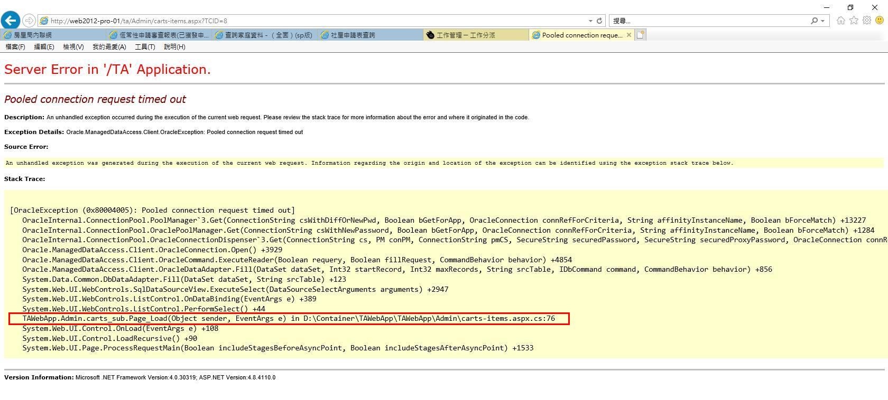

# "Pooled connection request timed out" raised on "carts-items.aspx.cs" line 76 



<span style="color:white;background:black;font-size:36px;bold:true;font-variant: small-caps;">Investigation Report</span>


## 1. Root cause

### carts-items.aspx.cs

```c#
15.	public partial class carts_sub : System.Web.UI.Page
16.	{
		. . . 
22. 	protected YRunner yr = new YRunner("conn");
		. . . 
49.		protected void Page_Load(object sender, EventArgs e)
50.		{
		. . . 
76.			ddTTID.DataBind();
77.			ddTRID.DataBind();
78.			txtTCLETCON.Text = ddTRID.SelectedItem.Text; 
		. . . 
```

### **Explanation**<br /> 
YRunner instanced had been successfully created but ddTTID.DataBind() method 
was unable to bind the Task Type dropdown due to an *un-responsive* server request. 


(*Photo from movie [Catch Me If You Can](https://www.imdb.com/title/tt0264464/)*)


## 2. Catch on DataBind
SqlDataSource has event **OnSelected** can be used to check whether exception 
occurs.<sup>[[1]](https://stackoverflow.com/questions/20987064/how-to-catch-exception-after-databind-event)</sup>

```c#
	protected void sourceDetails_Selected(object sender, SqlDataSourceStatusEventArgs e)
    	{
            if (e.Exception != null)
            {
            //Doing what we need to do
	    }
	}
```


## 3. Catch on Code/Page/App
Apart from the try catch exception handling technique, the ASP.NET Framework 
has error handling events where exceptions can be caught.<sup>[[2]](https://www.c-sharpcorner.com/UploadFile/de41d6/exceptionerror-handling-in-Asp-Net-simplified/)</sup>

### Code level
When there is an unhandled error at the code level, meaning if the code does 
not have a structured try catch block to handle exceptions, then that can be 
handled at the page level. **An unhandled exception is being propagated to the 
page level if not handled at the code level.**


### Page level
At the page level **Page_Error** is the event that catches the exception and we 
can handle the exception at the page level.

```c#
	protected void Page_Error(object sender, EventArgs e)  
	{  
	    Exception Ex = Server.GetLastError();  
	    Server.ClearError();  
	    Response.Redirect("Error.aspx");  
	}  
```

### Application level
**If an exception is not handled at the page level then it will be propagated 
to the application level** and at the application level in the **global.aspx** file 
there is an **Application_Error** event where the exception can be handled.

```c#
	void Application_Error(object sender, EventArgs e)  
	{  
	     // Code that runs when an unhandled error occurs  
	    Exception Ex =Server.GetLastError();  
	    Server.ClearError();  
	    Server.Transfer("Error.aspx");  
	}  
```

It could be a centralized place to handle all the required exception handling 
at the project level.


## 4. To Cover-up or Not... 
By means of [[1]](https://stackoverflow.com/questions/20987064/how-to-catch-exception-after-databind-event) and [[2]](https://www.c-sharpcorner.com/UploadFile/de41d6/exceptionerror-handling-in-Asp-Net-simplified/), **any exceptions can be caught at this three levels**. In light of the current situation, ie, "carts-items.aspx.cs" line 76, it's only possible to display a error page and let the program die gracefully. Moreover, consider: 

   1. This errors not frequently happen; 
   2. Only dispatchers (分派員) come across this error; 
   3. A ~~A Markoff~~ mask out will cover up *all* other errors. 

So, it is not appropriate to let errors from "carts-items.aspx.cs" unseen. 


## 5. Reference:
1. [How to catch exception after DataBind event?](https://stackoverflow.com/questions/20987064/how-to-catch-exception-after-databind-event)
2. [Exception/Error Handling in ASP.Net Simplified](https://www.c-sharpcorner.com/UploadFile/de41d6/exceptionerror-handling-in-Asp-Net-simplified/)
3. [OracleException Class](https://docs.microsoft.com/en-us/dotnet/api/system.data.oracleclient.oracleexception?view=netframework-4.8&fbclid=IwAR3vwU6k5D_mCRCb6-hBz2vu48kLrD7QeMBXb8OfaVOpg-rr-CvfFhEneIw)


## 6. epilogue
-  Current TA version is 2.8 (M). 

-1.JPG)

- "YRunner ─ The Accidental HA" means traffic will be diverted by YRunner to mirror site; 

- "UI improvements" means using Javascript/AJAX technique to prevent page postback and thus minimizing flickering (eye-friendly). 

---
### `supplementary`

```xml
<add name="conn" connectionString="DATA SOURCE=my-oracle/mypdb;USER ID=myuserid;PASSWORD=mypwd;PERSIST SECURITY INFO=True;Connection Timeout=120;Max Pool Size=500;" providerName="Oracle.ManagedDataAccess.Client" />

<connectionStrings>
<add name="conn" connectionString="DATA SOURCE=my-oracle/mypdb;USER ID=myuserid;PASSWORD=mypwd;PERSIST SECURITY INFO=True;Connection Timeout=120;Max Pool Size=500;" providerName="Oracle.ManagedDataAccess.Client" />    
</connectionStrings>

```
---

## EOF (2021/08/27 Created)
## EOF (2022/06/26 Revised)
